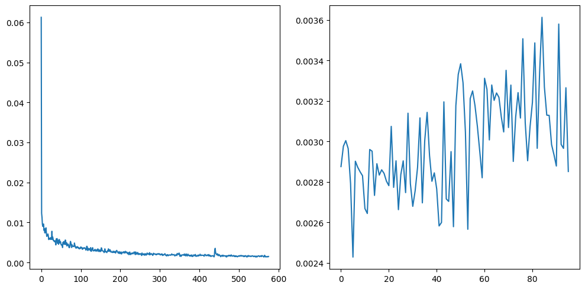
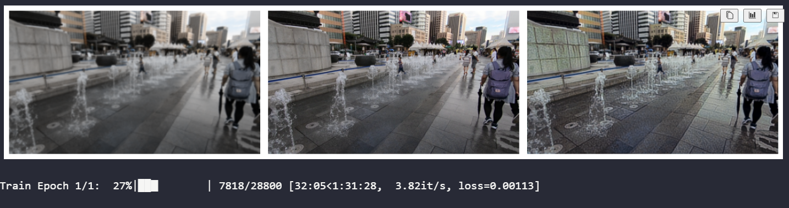
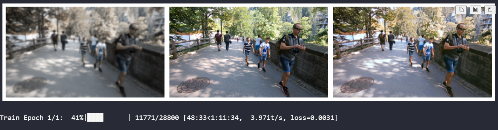
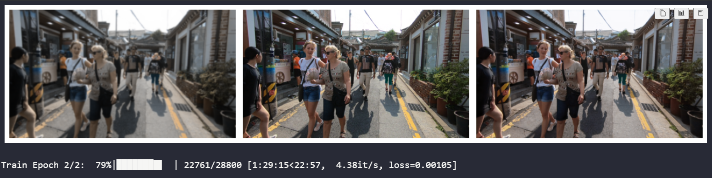
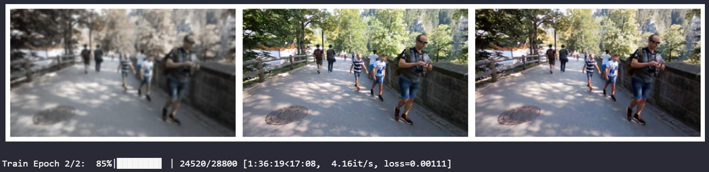
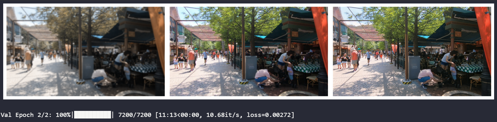

# GNR 638 Mini Project 2

## Image Deblurring

1. Download sharp images from here: [Google Drive Link](https://drive.usercontent.google.com/download?id=1YLksKtMhd2mWyVSkvhDaDLWSc1qYNCz-&export=download&authuser=0)

2. Downscale the images to (256,448). (Set A)

3. Create a set of images by applying different Gaussian filters to each image: (Set B)
   a. Kernel size = 3x3, sigma = 0.3
   b. Kernel size = 7x7, sigma = 1
   c. Kernel size = 11x11, sigma = 1.6

4. Design a network to deblur images (Set B -> Set A) with an upper limit of 15M parameters.

5. Test set will be provided along with ground truth later. We will also provide an evaluation script. Please report PSNR score according to this score.

6. Please use:

   - numpy==1.24.4
   - PIL==10.2
   - scikit-image==0.21 \
     for preprocessing and running evaluation script.

7. You need to submit:
   - Codes
   - Final checkpoint
   - Report (contains model architecture, training details, training curves, qualitative and quantitative results)

## Link to Saved Checkpoint and GitHub Repo

Link to GitHub Repository [here](https://github.com/shubham282raj/gnr638-project-2) \
Link to Report and Checkpoint [here](https://drive.google.com/drive/folders/1YZXyki5HCdWvTSW3RkysrTmDICQN0jtq?usp=sharing)

## How To Use?

- Download the train dataset from [here](https://drive.usercontent.google.com/download?id=1YLksKtMhd2mWyVSkvhDaDLWSc1qYNCz-&export=download&authuser=0)
- Download the eval dataset and eval script from [here](https://drive.google.com/file/d/1Ud-hevBqRrJtb41i1YEXBiISzk_Oij0P/view)
- Clone/Download the Repo `git clone https://github.com/shubham282raj/gnr638-project-2.git`
- Extract both train and test dataset in `dataset` folder in root directory
- Run `main.ipynb`, this will
  - Process the dataset and make blur and sharp dataset
  - Create PyTorch dataloader
  - Define the Model (UNet)
  - Train the model
  - Plot Train/Val Losses averaged over few 100 batches
- To Evaluate on eval dataset and eval script, run `eval.ipynb`, this will
  - Go through test dataset and make it's prediction making blurry images sharp
  - Run the provided script in `utils` to print the **PSNR Score**

## Architecture Used: UNet

- The UNet Model structure was first motivated from a GitHub Repository from **milesial** where they used UNet and implemented it for **Image Segmentation** in `PyTorch` with over 30 Million Parameters
- Link to there GitHub Repo [here](https://github.com/milesial/Pytorch-UNet)
- We used just the model architecture for our project
- There UNet Model had
  - 4 Encoders
  - 4 Decoders
  - Over 30 Million Parameters
- Changes we made in out UNet Model
  - 3 Encoders
  - 3 Decoders
  - 7.7 Million Parameters

## Device Specification

There device used to train and evaluate the model had

- AMD Ryzen 7 5800H CPU
- NVIDIA GeForce RTX 3050 Laptop GPU
- 8 GB 3200 MHz RAM

## Training Details

- 80/20 Train Val Split
- Total Number of (blur, sharp) image pair = 72,000
- Total Number of parameters in UNet Model = 7.7M
- Batch Size = 2
- Epochs Trained = 2
- Criterion Used - MSE Loss
- Optimizer Used - Adam (lr=0.001)
- Total Time Taken = 3.6 Hours
- Train Iter Batches per second = 4.3 it/s
- Val Iter Batches per second = 11.0 it/s

## Train/Val Losses Curve

Train curve was taken moving average over 100 batches and val curve was taken moving average over 150 batches

## Summary

- Total Parameters: 7.7M
- Train Time: 3.6 Hours
- Average PSNR between corresponding images: 27.556361211650493 dB

## Some Examples of Deblurring

<table style="width:100%">
  <tr>
    <th style="text-align:center">Blur Image</th>
    <th style="text-align:center">Sharp Image</th>
    <th style="text-align:center">Model Output Image</th>
  </tr>
</table>

